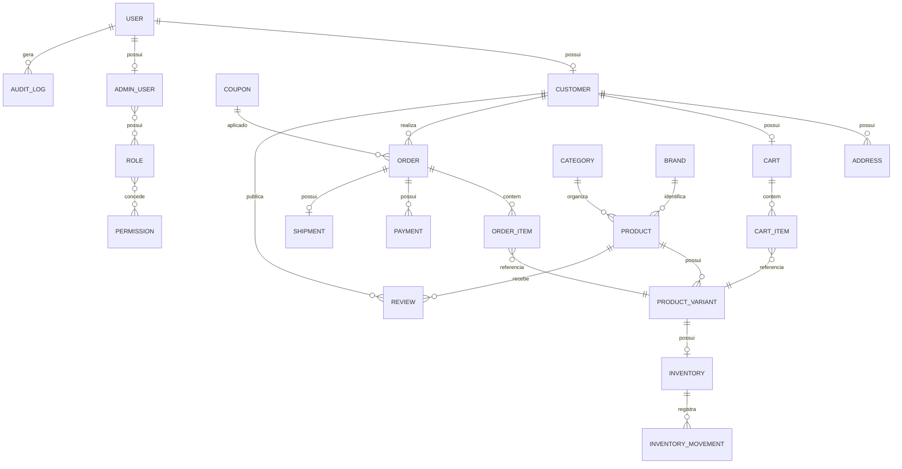

# Tropa Fight

**Versão planejada:** 1.0

**Status:** PLANEJAMENTO EM DEFINIÇÃO

## Visão

Tropa Fight é uma plataforma de comércio eletrônico especializada em **artes marciais, esportes de combate e treinamento físico**, disponibilizada por meio de uma experiência web responsiva e, conforme a estratégia definida para o projeto, dispositivos móveis.

A plataforma centraliza a descoberta, consulta e aquisição de equipamentos, vestuário e acessórios relacionados a lutas e treinamento, oferecendo ao cliente uma experiência integrada de catálogo, carrinho, checkout, pagamento, acompanhamento de pedidos e gerenciamento da própria conta.

Para a operação da loja, a Tropa Fight também disponibiliza uma área administrativa responsável pelo gerenciamento de produtos, categorias, variações, preços, estoque, pedidos, clientes, avaliações, cupons, promoções e usuários administrativos.

O sistema deverá ser construído com foco em **separação de responsabilidades, segurança, integridade dos dados, controle de acesso, testabilidade, observabilidade e capacidade de evolução**.

A arquitetura em camadas é a referência inicial do projeto, separando apresentação, aplicação, domínio e infraestrutura. A estrutura definitiva será registrada nos ADRs após a análise arquitetural.

---

# Escopo da V1

A definição final da V1 ainda depende da elicitação. O escopo inicialmente previsto é:

* Contas de clientes com cadastro, autenticação, recuperação de acesso, perfil e endereços.
* Catálogo de produtos de artes marciais, esportes de combate e treinamento.
* Categorias e, quando necessário, subcategorias.
* Marcas e informações comerciais dos produtos.
* Produtos com possíveis variações de tamanho, cor, peso, modelo ou outras características.
* SKU e controle de disponibilidade.
* Imagens e informações detalhadas dos produtos.
* Busca, filtros e ordenação.
* Página de detalhes do produto.
* Carrinho de compras.
* Seleção de variantes e quantidades.
* Cálculo de subtotal.
* Aplicação de cupons e promoções, caso aprovados para a V1.
* Checkout.
* Seleção ou cadastro de endereço.
* Cálculo de frete.
* Seleção de modalidade de entrega.
* Pagamento por meios definidos durante a elicitação.
* Criação e acompanhamento de pedidos.
* Histórico de compras.
* Atualização do status dos pedidos.
* Rastreamento de entrega, caso suportado pela integração escolhida.
* Avaliações de produtos, caso aprovadas para a V1.
* Favoritos, caso aprovados para a V1.
* Notificações transacionais, conforme canais definidos.
* Painel administrativo.
* Administração de produtos, categorias, variantes, marcas e preços.
* Administração de estoque e movimentações.
* Administração de pedidos.
* Administração de clientes.
* Administração de avaliações.
* Administração de cupons e promoções.
* Usuários administrativos e permissões.
* Auditoria de operações administrativas sensíveis.
* Logs, monitoramento e observabilidade.
* Backup e recuperação.
* Controles de segurança e proteção de dados.

---

# Fora de escopo

Os itens abaixo ainda não foram aprovados como parte da V1 e deverão ser classificados durante a elicitação:

* Marketplace com múltiplos vendedores.
* Venda de produtos de terceiros com contas independentes de vendedor.
* Programa de afiliados.
* Assinaturas recorrentes.
* Sistema de aluguel de equipamentos.
* Integração com múltiplos ERPs sem necessidade comprovada.
* BI avançado e data warehouse.
* Sistema avançado de recomendação baseado em machine learning.
* Chat interno entre cliente e vendedor.
* Rede social interna.
* Programa de fidelidade, caso não seja aprovado.
* Clube de assinatura.
* Operação internacional e múltiplas moedas.
* Venda fora do mercado brasileiro, salvo decisão posterior.
* Funcionalidades não relacionadas diretamente à operação da loja.

**Observação:** itens classificados como fora de escopo poderão ser reconsiderados mediante mudança formal de escopo.

---

# Stakeholders e atores

| **Ator**                       | **Objetivo e permissões**                                                                                                                                                       |
| ------------------------------ | ------------------------------------------------------------------------------------------------------------------------------------------------------------------------------- |
| Cliente                        | Criar conta, navegar pelo catálogo, pesquisar produtos, selecionar variantes, adicionar itens ao carrinho, comprar, acompanhar pedidos, avaliar produtos e gerenciar sua conta. |
| Administrador geral            | Gerenciar toda a operação administrativa da Tropa Fight, incluindo produtos, estoque, pedidos, clientes, promoções, usuários e configurações autorizadas.                       |
| Gestor de catálogo             | Gerenciar produtos, categorias, marcas, variantes, imagens, preços e informações do catálogo conforme permissões.                                                               |
| Gestor de estoque              | Consultar estoque, registrar entradas e saídas, realizar ajustes autorizados e consultar movimentações.                                                                         |
| Atendimento                    | Consultar clientes e pedidos e executar operações autorizadas relacionadas ao atendimento.                                                                                      |
| Financeiro                     | Consultar pagamentos, pedidos, reembolsos e operações financeiras conforme permissões.                                                                                          |
| Serviço de pagamento           | Processar ou confirmar pagamentos por meio da integração escolhida.                                                                                                             |
| Serviço de entrega             | Calcular frete, disponibilizar modalidades e/ou fornecer informações de rastreamento conforme integração escolhida.                                                             |
| Serviço de e-mail/notificações | Enviar comunicações transacionais e notificações da plataforma.                                                                                                                 |
| Serviço de armazenamento       | Armazenar imagens de produtos e outros arquivos necessários ao sistema.                                                                                                         |
| Serviço de monitoramento       | Receber informações de erros, métricas e disponibilidade, quando aplicável.                                                                                                     |

Os perfis administrativos acima são candidatos iniciais. A granularidade definitiva das permissões deverá ser definida durante a elicitação.

---

# Requisitos funcionais

| **ID** | **Requisito**                        | **Prioridade** | **Critérios de aceitação resumidos**                                                                                                        |
| ------ | ------------------------------------ | -------------- | ------------------------------------------------------------------------------------------------------------------------------------------- |
| RF-001 | Cadastro e acesso                    | MUST           | Cliente consegue criar conta, autenticar-se, encerrar sessão e recuperar o acesso conforme as regras definidas.                             |
| RF-002 | Gerenciamento de conta               | MUST           | Cliente consegue consultar e alterar os dados permitidos e gerenciar seus endereços.                                                        |
| RF-003 | Catálogo de produtos                 | MUST           | Sistema apresenta produtos disponíveis e suas informações comerciais e técnicas.                                                            |
| RF-004 | Categorias e marcas                  | MUST           | Cliente consegue navegar pelo catálogo utilizando categorias e, quando aplicável, marcas.                                                   |
| RF-005 | Pesquisa e filtros                   | MUST           | Cliente consegue pesquisar e filtrar produtos conforme os critérios aprovados.                                                              |
| RF-006 | Detalhes do produto                  | MUST           | Sistema apresenta descrição, imagens, preço, disponibilidade e variantes aplicáveis.                                                        |
| RF-007 | Variantes de produto                 | MUST           | Cliente consegue selecionar uma variante válida antes de adicionar o produto ao carrinho quando necessário.                                 |
| RF-008 | Carrinho                             | MUST           | Cliente consegue adicionar, remover e alterar quantidades de itens e visualizar os valores correspondentes.                                 |
| RF-009 | Cupons e promoções                   | SHOULD         | Sistema permite aplicar descontos conforme regras de validade, elegibilidade e utilização definidas.                                        |
| RF-010 | Checkout                             | MUST           | Cliente consegue revisar os itens, endereço, entrega, descontos, pagamento e valor total antes da confirmação.                              |
| RF-011 | Pagamento                            | MUST           | Sistema cria e acompanha pagamentos utilizando o provedor definido, tratando aprovação, recusa, pendência e falhas.                         |
| RF-012 | Pedido                               | MUST           | Sistema cria pedido consistente após as condições necessárias do checkout e permite consultar seu estado.                                   |
| RF-013 | Acompanhamento do pedido             | MUST           | Cliente consegue consultar o status do pedido e informações de entrega disponíveis.                                                         |
| RF-014 | Histórico de compras                 | MUST           | Cliente consegue consultar seus pedidos anteriores e respectivas informações.                                                               |
| RF-015 | Estoque                              | MUST           | Sistema controla disponibilidade de produtos/variantes e impede operações que resultem em estoque inconsistente.                            |
| RF-016 | Movimentação de estoque              | MUST           | Usuários autorizados conseguem registrar e consultar movimentações de estoque conforme permissões.                                          |
| RF-017 | Avaliações                           | SHOULD         | Cliente elegível pode avaliar produtos conforme regras de compra, nota, comentário e moderação definidas.                                   |
| RF-018 | Favoritos                            | SHOULD         | Cliente pode adicionar, remover e consultar produtos favoritos.                                                                             |
| RF-019 | Notificações                         | SHOULD         | Sistema envia notificações relacionadas a cadastro, pedidos, pagamentos, entrega e outros eventos aprovados.                                |
| RF-020 | Administração de produtos            | MUST           | Usuários autorizados conseguem criar, editar, publicar, inativar e gerenciar produtos e variantes.                                          |
| RF-021 | Administração de categorias e marcas | MUST           | Usuários autorizados conseguem gerenciar categorias, subcategorias e marcas conforme o modelo aprovado.                                     |
| RF-022 | Administração de estoque             | MUST           | Usuários autorizados conseguem consultar estoque e executar ajustes e movimentações permitidos.                                             |
| RF-023 | Administração de pedidos             | MUST           | Usuários autorizados conseguem consultar e executar operações administrativas permitidas sobre pedidos.                                     |
| RF-024 | Administração de clientes            | MUST           | Usuários autorizados conseguem consultar informações de clientes conforme suas permissões.                                                  |
| RF-025 | Administração de avaliações          | SHOULD         | Usuários autorizados conseguem consultar, moderar e tratar avaliações conforme as regras definidas.                                         |
| RF-026 | Administração de cupons e promoções  | SHOULD         | Usuários autorizados conseguem criar, alterar, ativar, desativar e consultar promoções e cupons.                                            |
| RF-027 | Usuários administrativos             | MUST           | Administrador autorizado consegue gerenciar usuários administrativos e suas permissões.                                                     |
| RF-028 | Auditoria                            | MUST           | Operações administrativas sensíveis são registradas com ator, ação, alvo, data e contexto necessário.                                       |
| RF-029 | Relatórios operacionais              | SHOULD         | Usuários autorizados conseguem consultar indicadores operacionais definidos para a loja.                                                    |
| RF-030 | Integrações externas                 | MUST           | Sistema integra-se aos serviços externos necessários para pagamento, entrega, notificações e armazenamento conforme decisões arquiteturais. |

---

# Requisitos não funcionais

| **ID**  | **Requisito verificável**                                                                                                                             |
| ------- | ----------------------------------------------------------------------------------------------------------------------------------------------------- |
| RNF-001 | A interface deverá ser responsiva para os dispositivos e navegadores definidos como suportados antes da produção.                                     |
| RNF-002 | Fluxos críticos deverão possuir requisitos mínimos de acessibilidade definidos e verificáveis.                                                        |
| RNF-003 | Operações críticas de catálogo, carrinho, checkout e consulta de pedidos deverão possuir metas de desempenho mensuráveis definidas antes da produção. |
| RNF-004 | Senhas deverão ser armazenadas utilizando mecanismo de hash apropriado; credenciais e segredos não poderão ser armazenados no código-fonte.           |
| RNF-005 | Dados em trânsito deverão utilizar comunicação segura por TLS/HTTPS.                                                                                  |
| RNF-006 | Operações administrativas deverão utilizar autenticação e autorização adequadas ao perfil do usuário.                                                 |
| RNF-007 | Operações sensíveis de administração deverão possuir rastreabilidade por meio de auditoria.                                                           |
| RNF-008 | Integrações de pagamento deverão possuir tratamento adequado de autenticação, idempotência e confirmação de eventos.                                  |
| RNF-009 | O sistema deverá proteger contra acesso não autorizado a dados de clientes, pedidos, endereços e demais informações privadas.                         |
| RNF-010 | Operações críticas de estoque deverão preservar integridade e consistência mesmo diante de compras concorrentes.                                      |
| RNF-011 | Backups deverão possuir frequência, retenção, armazenamento e procedimento de restauração definidos antes da produção.                                |
| RNF-012 | A restauração de backup deverá ser testável e possuir critérios de sucesso definidos.                                                                 |
| RNF-013 | O sistema deverá possuir logs estruturados para erros e eventos operacionais relevantes.                                                              |
| RNF-014 | Falhas críticas de pagamento, checkout, estoque e integrações deverão ser observáveis e gerar alertas quando necessário.                              |
| RNF-015 | O sistema deverá observar requisitos aplicáveis de proteção de dados pessoais, incluindo LGPD.                                                        |
| RNF-016 | A solução deverá possuir testes automatizados proporcionais ao risco e criticidade das funcionalidades.                                               |
| RNF-017 | A arquitetura deverá manter separação entre apresentação, aplicação, domínio e infraestrutura conforme decisão arquitetural aprovada.                 |
| RNF-018 | A solução deverá evitar dependências desnecessárias entre regras de negócio e serviços externos.                                                      |

---

# Regras de negócio

As regras abaixo representam regras conhecidas ou áreas de regra que precisam ser formalizadas. Onde a definição ainda não foi decidida, a regra permanece pendente.

| **ID** | **Regra**                                                                                                                                                                 |
| ------ | ------------------------------------------------------------------------------------------------------------------------------------------------------------------------- |
| RN-001 | Somente clientes em estado permitido poderão realizar compras.                                                                                                            |
| RN-002 | Um produto que possua variantes deverá exigir uma variante válida quando a operação de compra depender dela.                                                              |
| RN-003 | A quantidade adquirida não poderá exceder a quantidade disponível conforme a estratégia de estoque definida.                                                              |
| RN-004 | Operações concorrentes de compra não poderão resultar em estoque negativo ou venda de unidade inexistente.                                                                |
| RN-005 | O preço utilizado no pedido deverá ser preservado no momento adequado da confirmação da compra, não sendo recalculado posteriormente a partir do preço atual do catálogo. |
| RN-006 | Produtos inativados não deverão aparecer como produtos disponíveis para novas compras, mas pedidos históricos deverão preservar suas informações relevantes.              |
| RN-007 | Alterações administrativas sensíveis de estoque deverão registrar o responsável e o motivo quando essa informação fizer parte da política aprovada.                       |
| RN-008 | Um pedido deverá possuir um estado consistente com o estado de pagamento e entrega conforme as regras de transição definidas.                                             |
| RN-009 | Eventos externos de pagamento deverão ser tratados de maneira idempotente para evitar processamento duplicado.                                                            |
| RN-010 | Um pagamento recusado ou expirado não poderá ser tratado como pagamento confirmado.                                                                                       |
| RN-011 | O sistema não deverá considerar um pedido como pago apenas com base em uma informação enviada pelo cliente.                                                               |
| RN-012 | Alterações de preço não deverão alterar retroativamente o valor de pedidos já confirmados.                                                                                |
| RN-013 | Cupons somente poderão ser aplicados quando o cliente e os itens atenderem aos critérios definidos pelo cupom.                                                            |
| RN-014 | Cupons expirados, desativados ou cujo limite de utilização tenha sido atingido não poderão ser utilizados.                                                                |
| RN-015 | Avaliações deverão obedecer às regras de elegibilidade e moderação definidas durante a elicitação.                                                                        |
| RN-016 | Usuários administrativos somente poderão executar operações compatíveis com suas permissões.                                                                              |
| RN-017 | Não poderá existir operação administrativa que permita contornar silenciosamente os mecanismos de autorização.                                                            |
| RN-018 | Dados privados de um cliente não poderão ser expostos a outro cliente.                                                                                                    |
| RN-019 | Operações administrativas sensíveis deverão ser auditáveis quando definidas como auditáveis.                                                                              |
| RN-020 | Cancelamento, devolução, troca e reembolso deverão possuir regras próprias e não poderão ser tratados simplesmente como exclusão do pedido.                               |

### Regras ainda pendentes

* RN-PD-001 — Momento exato da reserva/baixa de estoque.
* RN-PD-002 — Prazo de reserva de estoque durante pagamento pendente.
* RN-PD-003 — Política de cancelamento.
* RN-PD-004 — Política de devolução.
* RN-PD-005 — Política de troca.
* RN-PD-006 — Política de reembolso.
* RN-PD-007 — Regras de acúmulo de cupons e promoções.
* RN-PD-008 — Limite de utilização de cupons.
* RN-PD-009 — Elegibilidade para avaliação.
* RN-PD-010 — Estados definitivos do pedido.
* RN-PD-011 — Estados definitivos do pagamento.
* RN-PD-012 — Política de frete grátis.
* RN-PD-013 — Regiões atendidas.
* RN-PD-014 — Política de retirada física, caso exista.

---

# Casos de uso

| **ID** | **Caso**                           | **Ator**                       | **Fluxo principal**                                                                   |
| ------ | ---------------------------------- | ------------------------------ | ------------------------------------------------------------------------------------- |
| UC-001 | Criar conta                        | Cliente                        | Cliente informa dados, sistema valida e cria a conta conforme regras de autenticação. |
| UC-002 | Autenticar cliente                 | Cliente                        | Cliente informa credenciais, sistema valida e cria sessão autenticada.                |
| UC-003 | Recuperar acesso                   | Cliente                        | Cliente solicita recuperação e recebe mecanismo seguro para redefinição.              |
| UC-004 | Navegar pelo catálogo              | Cliente                        | Cliente consulta categorias, produtos, filtros e detalhes.                            |
| UC-005 | Consultar produto                  | Cliente                        | Cliente visualiza informações, variantes, preço e disponibilidade.                    |
| UC-006 | Adicionar produto ao carrinho      | Cliente                        | Cliente seleciona produto/variante e quantidade válidos.                              |
| UC-007 | Gerenciar carrinho                 | Cliente                        | Cliente altera quantidades, remove itens e consulta valores.                          |
| UC-008 | Realizar checkout                  | Cliente                        | Cliente confirma itens, endereço, entrega, descontos e pagamento.                     |
| UC-009 | Processar pagamento                | Cliente/Sistema/Provedor       | Sistema cria e acompanha pagamento e processa eventos de confirmação.                 |
| UC-010 | Criar pedido                       | Sistema                        | Sistema cria pedido consistente após as condições necessárias serem atendidas.        |
| UC-011 | Acompanhar pedido                  | Cliente                        | Cliente consulta estado, pagamento e entrega disponíveis.                             |
| UC-012 | Avaliar produto                    | Cliente                        | Cliente elegível registra avaliação conforme regras definidas.                        |
| UC-013 | Gerenciar favoritos                | Cliente                        | Cliente adiciona ou remove produtos favoritos.                                        |
| UC-014 | Administrar catálogo               | Gestor/Admin                   | Usuário autorizado cria, altera, publica ou inativa produtos.                         |
| UC-015 | Administrar estoque                | Gestor/Admin                   | Usuário autorizado consulta e movimenta estoque.                                      |
| UC-016 | Administrar pedidos                | Admin/Atendimento              | Usuário autorizado consulta e executa operações permitidas.                           |
| UC-017 | Administrar clientes               | Admin/Atendimento              | Usuário autorizado consulta informações permitidas dos clientes.                      |
| UC-018 | Administrar promoções              | Gestor/Admin                   | Usuário autorizado gerencia cupons e promoções.                                       |
| UC-019 | Moderar avaliações                 | Gestor/Admin                   | Usuário autorizado consulta e modera avaliações.                                      |
| UC-020 | Gerenciar usuários administrativos | Administrador geral            | Administrador cria, altera, bloqueia e configura permissões administrativas.          |
| UC-021 | Auditar operação                   | Administrador autorizado       | Usuário consulta eventos administrativos permitidos.                                  |
| UC-022 | Processar integração de entrega    | Sistema/Serviço de entrega     | Sistema envia dados e recebe cálculo/rastreamento conforme integração.                |
| UC-023 | Enviar notificação                 | Sistema/Serviço de notificação | Sistema dispara comunicação relacionada a eventos relevantes.                         |

---

# Modelo de domínio

A modelagem inicial da Tropa Fight considera os seguintes grupos:

### Identidade e acesso

`User`, `Customer`, `AdminUser`, `Role`, `Permission`

### Catálogo

`Product`, `ProductVariant`, `Category`, `Brand`

### Estoque

`Inventory`, `InventoryMovement`

### Compra

`Cart`, `CartItem`, `Order`, `OrderItem`

### Pagamento e entrega

`Payment`, `Shipment`

### Promoções

`Coupon`, `Promotion`

### Experiência do cliente

`Review`, `Notification`

### Governança

`AuditLog`

Modelo conceitual inicial:



Esse modelo é inicial e deverá ser validado durante a análise de domínio.

---

# Modelo inicial de dados

| **Agregado/Tabela** | **Campos e restrições relevantes**                                                  |
| ------------------- | ----------------------------------------------------------------------------------- |
| users               | id, nome, e-mail, credenciais, status, timestamps e dados necessários de auditoria. |
| customers           | referência ao usuário, dados específicos do cliente e status.                       |
| admin_users         | referência ao usuário, perfil administrativo e status.                              |
| roles               | identificação, nome e status.                                                       |
| permissions         | recurso, ação e identificação da permissão.                                         |
| user_roles          | relacionamento entre usuários administrativos e funções.                            |
| addresses           | cliente, dados de endereço, identificação e status.                                 |
| products            | nome, descrição, marca, categoria, status, informações comerciais e timestamps.     |
| product_variants    | produto, SKU, atributos, preço quando aplicável, disponibilidade e status.          |
| categories          | nome, descrição, hierarquia e status.                                               |
| brands              | nome, descrição e status.                                                           |
| inventory           | variante, quantidade disponível/reservada e informações de controle.                |
| inventory_movements | variante, tipo, quantidade, motivo, ator e data.                                    |
| carts               | cliente/identificação de visitante, status e timestamps.                            |
| cart_items          | carrinho, variante e quantidade.                                                    |
| orders              | cliente, valores, endereço, estado, timestamps e dados de confirmação.              |
| order_items         | pedido, variante, quantidade, preço capturado e descontos aplicados.                |
| payments            | pedido, provedor, referência externa, valor, estado e timestamps.                   |
| shipments           | pedido, modalidade, endereço, custo, prazo, código de rastreamento e estado.        |
| coupons             | código, tipo, valor, validade, limites e status.                                    |
| promotions          | nome, regras, período e status.                                                     |
| reviews             | cliente, produto, nota, comentário, estado de moderação e timestamps.               |
| notifications       | destinatário, tipo, canal, conteúdo/referência, estado e timestamps.                |
| audit_logs          | ator, ação, alvo, contexto, data e correlação.                                      |

O modelo definitivo deverá ser produzido após a validação das regras de negócio.

---

# Arquitetura proposta

A Tropa Fight deverá utilizar uma arquitetura em camadas, inicialmente organizada conceitualmente como:

```text
┌─────────────────────────────────────────────┐
│                APRESENTAÇÃO                 │
│ Web / Mobile / Área Administrativa          │
├─────────────────────────────────────────────┤
│                 APLICAÇÃO                  │
│ Casos de uso / Orquestração / DTOs         │
├─────────────────────────────────────────────┤
│                  DOMÍNIO                   │
│ Entidades / Regras / Invariantes           │
├─────────────────────────────────────────────┤
│               INFRAESTRUTURA               │
│ Banco / Pagamento / Entrega / E-mail       │
│ Storage / Observabilidade / Serviços       │
└─────────────────────────────────────────────┘
```

A aplicação deverá preferencialmente evitar que:

* regras de negócio dependam diretamente de frameworks;
* domínio dependa de banco de dados;
* domínio dependa diretamente de gateway de pagamento;
* domínio dependa diretamente de transportadora;
* apresentação contenha regras de negócio críticas.

A estratégia arquitetural final será documentada em ADR.

Para a primeira versão, deverá ser avaliada a utilização de uma arquitetura de **monólito modular em camadas**, caso isso seja suficiente para os requisitos identificados.

Microsserviços ou arquiteturas distribuídas não deverão ser introduzidos sem justificativa.

---

# APIs planejadas

As APIs abaixo são áreas funcionais iniciais:

| **Método/Rota**           | **Finalidade**              | **Autorização**          | **Relacionados** |
| ------------------------- | --------------------------- | ------------------------ | ---------------- |
| POST `/auth/register`     | Cadastro                    | Público                  | RF-001           |
| POST `/auth/login`        | Autenticação                | Público                  | RF-001           |
| POST `/auth/recover`      | Recuperação                 | Público                  | RF-001           |
| GET `/products`           | Catálogo                    | Público                  | RF-003/RF-005    |
| GET `/products/{id}`      | Detalhe                     | Público                  | RF-006           |
| GET `/categories`         | Categorias                  | Público                  | RF-004           |
| GET `/brands`             | Marcas                      | Público                  | RF-004           |
| GET `/cart`               | Consultar carrinho          | Cliente                  | RF-008           |
| POST `/cart/items`        | Adicionar item              | Cliente                  | RF-008           |
| PATCH `/cart/items/{id}`  | Alterar quantidade          | Cliente                  | RF-008           |
| DELETE `/cart/items/{id}` | Remover item                | Cliente                  | RF-008           |
| POST `/checkout`          | Iniciar checkout            | Cliente                  | RF-010           |
| POST `/payments`          | Criar pagamento             | Cliente/Sistema          | RF-011           |
| POST `/webhooks/payment`  | Processar confirmação       | Provedor                 | RF-011           |
| GET `/orders`             | Histórico                   | Cliente                  | RF-014           |
| GET `/orders/{id}`        | Detalhes do pedido          | Cliente                  | RF-013           |
| POST `/reviews`           | Criar avaliação             | Cliente                  | RF-017           |
| GET `/favorites`          | Favoritos                   | Cliente                  | RF-018           |
| `/admin/products`         | Administração de produtos   | Admin autorizado         | RF-020           |
| `/admin/categories`       | Administração de categorias | Admin autorizado         | RF-021           |
| `/admin/inventory`        | Administração de estoque    | Permissão específica     | RF-022           |
| `/admin/orders`           | Administração de pedidos    | Permissão específica     | RF-023           |
| `/admin/customers`        | Administração de clientes   | Permissão específica     | RF-024           |
| `/admin/reviews`          | Moderação                   | Permissão específica     | RF-025           |
| `/admin/coupons`          | Cupons                      | Permissão específica     | RF-026           |
| `/admin/users`            | Usuários administrativos    | Administrador geral      | RF-027           |
| `/admin/audit-logs`       | Auditoria                   | Administrador autorizado | RF-028           |

Os endpoints definitivos deverão ser especificados posteriormente com:

* método;
* autenticação;
* autorização;
* entrada;
* saída;
* validação;
* erros;
* idempotência;
* paginação;
* filtros;
* requisitos relacionados.

---

# Tecnologias sugeridas

As tecnologias exatas permanecem **PENDENTES DE DECISÃO**.

O projeto deverá avaliar:

* framework web;
* estratégia mobile;
* linguagem;
* backend;
* banco relacional;
* ORM;
* autenticação;
* armazenamento de imagens;
* gateway de pagamento;
* serviço de entrega;
* serviço de e-mail;
* monitoramento;
* testes;
* CI/CD;
* hospedagem.

A escolha deverá considerar:

* requisitos da Tropa Fight;
* capacidade de manutenção;
* segurança;
* custo;
* produtividade;
* integração;
* testabilidade;
* escalabilidade necessária;
* conhecimento da equipe.

Não escolher fornecedor simplesmente por preferência.

---

# Segurança e privacidade

A Tropa Fight deverá utilizar:

* autenticação segura;
* autorização baseada em papéis/permissões;
* menor privilégio;
* proteção de sessão;
* hash seguro de senhas;
* proteção de credenciais;
* TLS/HTTPS;
* validação de entrada;
* proteção contra SQL Injection;
* proteção contra XSS;
* proteção contra CSRF conforme mecanismo de autenticação;
* rate limiting em operações sensíveis;
* controle de acesso por recurso;
* proteção de dados pessoais;
* auditoria administrativa;
* gestão segura de secrets;
* proteção das integrações externas.

Dados completos de cartão não deverão ser armazenados pela Tropa Fight sem necessidade.

Operações administrativas críticas deverão possuir rastreabilidade.

O tratamento de dados pessoais deverá observar a LGPD e demais obrigações aplicáveis.

---

# Estratégia de estoque

A integridade do estoque é considerada um requisito crítico.

O sistema deverá ser capaz de lidar com o cenário:

```text
Produto: Luva 12 oz
Estoque disponível: 1

Cliente A ───────┐
                 ├── tentativa simultânea de compra
Cliente B ───────┘
```

A implementação deverá impedir que duas operações válidas consumam a mesma unidade.

A solução deverá considerar:

* transações;
* atomicidade;
* concorrência;
* reserva;
* baixa;
* rollback;
* idempotência.

A estratégia definitiva será registrada em ADR.

---

# Backup e recuperação

A Tropa Fight deverá possuir estratégia de backup definida antes da produção.

Deverão ser definidos:

* frequência;
* retenção;
* armazenamento;
* criptografia;
* restauração;
* teste de restauração;
* RPO;
* RTO;
* recuperação de desastre.

Backup sem teste de restauração não deverá ser considerado suficiente.

---

# Observabilidade

A solução deverá possuir observabilidade proporcional à criticidade da operação.

Monitorar, conforme aplicável:

* erros;
* disponibilidade;
* latência;
* checkout;
* pagamentos;
* webhooks;
* estoque;
* pedidos;
* integrações;
* operações administrativas.

Deverão existir logs estruturados e mecanismos de alerta para falhas críticas.

---

# Estratégia de testes

Testes unitários deverão cobrir regras críticas de:

* preços;
* descontos;
* cupons;
* estoque;
* pedidos;
* permissões;
* transições de estado.

Testes de integração deverão cobrir:

* persistência;
* transações;
* pagamentos;
* webhooks;
* estoque;
* entrega;
* notificações.

Testes de API deverão cobrir:

* autenticação;
* autorização;
* validação;
* respostas de erro;
* ownership;
* operações administrativas.

Testes E2E deverão cobrir, conforme escopo da V1:

* cadastro;
* login;
* catálogo;
* seleção de variante;
* carrinho;
* checkout;
* pagamento;
* criação do pedido;
* acompanhamento;
* operações administrativas críticas.

Testes de segurança deverão contemplar:

* RBAC;
* ownership;
* autenticação;
* autorização;
* entrada maliciosa;
* webhooks;
* acesso administrativo.

Testes de concorrência deverão cobrir a disputa pela última unidade de estoque.

Cada TASK deverá declarar seus testes e Quality Gates aplicáveis.

---

# Riscos

| **Risco**                                                   | **Probabilidade/Impacto** | **Mitigação**                                                                       |
| ----------------------------------------------------------- | ------------------------- | ----------------------------------------------------------------------------------- |
| Concorrência no estoque                                     | Alta/Alta                 | Transações, estratégia de reserva/baixa e testes concorrentes.                      |
| Falha ou duplicidade de webhook de pagamento                | Média/Alta                | Idempotência, persistência de eventos e reprocessamento controlado.                 |
| Integração de entrega indisponível                          | Média/Alta                | Tratamento de falhas, retries e estratégia de contingência.                         |
| Definição insuficiente das regras de cancelamento/reembolso | Média/Alta                | Elicitação específica antes da implementação.                                       |
| Complexidade excessiva de web/mobile                        | Média/Alta                | Compartilhamento de regras de negócio e avaliação arquitetural prévia.              |
| Vazamento de dados de clientes                              | Baixa/Alta                | Controle de acesso, menor privilégio, testes de segurança e auditoria.              |
| Falhas de backup/restauração                                | Média/Alta                | Testes periódicos de restauração e definição de RPO/RTO.                            |
| Dependência de provedores externos                          | Média/Média               | Abstrações apropriadas, retries, observabilidade e tratamento de indisponibilidade. |
| Crescimento prematuro da arquitetura                        | Média/Média               | Monólito modular inicial quando suficiente e ADR para decisões significativas.      |
| Regras de negócio ainda indefinidas                         | Alta/Alta                 | Elicitação antes da implementação.                                                  |

---

# Roadmap

| **Fase** | **Objetivo**             | **Entregável/Critério**                                                |
| -------- | ------------------------ | ---------------------------------------------------------------------- |
| PHASE-01 | Descoberta e arquitetura | Requisitos, domínio, arquitetura, ADRs e documentação aprovados.       |
| PHASE-02 | Fundação                 | Estrutura do projeto, autenticação, autorização e infraestrutura base. |
| PHASE-03 | Catálogo                 | Produtos, categorias, marcas, variantes e descoberta.                  |
| PHASE-04 | Estoque                  | Controle de estoque, movimentações e concorrência.                     |
| PHASE-05 | Carrinho                 | Carrinho, quantidades, disponibilidade e descontos.                    |
| PHASE-06 | Checkout                 | Endereço, frete, resumo e confirmação.                                 |
| PHASE-07 | Pagamentos               | Integração de pagamento, confirmação e idempotência.                   |
| PHASE-08 | Pedidos e entrega        | Pedidos, estados, envio e rastreamento.                                |
| PHASE-09 | Administração            | Produtos, estoque, pedidos, clientes, promoções e permissões.          |
| PHASE-10 | Experiência complementar | Avaliações, favoritos e notificações aprovadas.                        |
| PHASE-11 | Segurança e operação     | Auditoria, observabilidade, backup e recuperação.                      |
| PHASE-12 | Testes e estabilização   | Quality Gates, regressão, segurança e aceitação.                       |
| PHASE-13 | Produção                 | Deploy, monitoramento e critérios de operação.                         |

A ordem definitiva deverá ser determinada pelas dependências identificadas no planejamento.

---

# Matriz de rastreabilidade inicial

| **RF**     | **RN**         | **RNF**         | **UC**         | **Entidades**                     | **API**                  | **Teste**                    | **TASK**  |
| ---------- | -------------- | --------------- | -------------- | --------------------------------- | ------------------------ | ---------------------------- | --------- |
| RF-001/002 | RN-001         | RNF-004/006     | UC-001/002/003 | User, Customer                    | `/auth`                  | Unit/API/E2E                 | A definir |
| RF-003–007 | RN-002/006     | RNF-001/003/017 | UC-004/005     | Product, Variant, Category, Brand | `/products`              | Unit/API/E2E                 | A definir |
| RF-008/009 | RN-003/012–014 | RNF-003/010     | UC-006/007     | Cart, CartItem, Coupon            | `/cart`                  | Unit/Integration/E2E         | A definir |
| RF-010/011 | RN-008/009/010 | RNF-008         | UC-008/009     | Order, Payment                    | `/checkout`, `/payments` | Integration/E2E              | A definir |
| RF-012–014 | RN-005/008/010 | RNF-009/013     | UC-010/011     | Order, OrderItem, Shipment        | `/orders`                | Integration/E2E              | A definir |
| RF-015/016 | RN-003/004/007 | RNF-010         | UC-015         | Inventory, InventoryMovement      | `/admin/inventory`       | Unit/Integration/Concurrency | A definir |
| RF-017     | RN-015         | RNF-009         | UC-012/019     | Review                            | `/reviews`               | API/E2E                      | A definir |
| RF-020–023 | RN-006/007/016 | RNF-006/007     | UC-014/015/016 | Product, Inventory, Order         | `/admin/*`               | API/Integration              | A definir |
| RF-026/027 | RN-013/014/016 | RNF-006/007     | UC-018/020     | Coupon, Role, Permission          | `/admin/*`               | API/Security                 | A definir |
| RF-028     | RN-019         | RNF-007         | UC-021         | AuditLog                          | `/admin/audit-logs`      | Integration/Security         | A definir |

A matriz será completada e refinada após a definição das TASKs.

---

# Pendências

| **ID** | **Descrição**                                  | **Impacto**                   |
| ------ | ---------------------------------------------- | ----------------------------- |
| PD-001 | Definição exata da V1.                         | Escopo e roadmap.             |
| PD-002 | Público-alvo prioritário da Tropa Fight.       | Catálogo e experiência.       |
| PD-003 | Modalidades de luta prioritárias.              | Catálogo e categorias.        |
| PD-004 | Catálogo inicial de produtos.                  | Modelo de domínio e dados.    |
| PD-005 | Estratégia de variantes/SKUs.                  | Produto e estoque.            |
| PD-006 | Momento de reserva e baixa de estoque.         | Checkout e concorrência.      |
| PD-007 | Política de cancelamento.                      | Pedidos e pagamentos.         |
| PD-008 | Política de devolução e troca.                 | Pedidos e logística.          |
| PD-009 | Política de reembolso.                         | Pagamentos.                   |
| PD-010 | Gateway/provedor de pagamento.                 | Checkout e integração.        |
| PD-011 | Meios de pagamento aceitos.                    | Checkout.                     |
| PD-012 | Transportadora/serviço de entrega.             | Frete e rastreamento.         |
| PD-013 | Regiões inicialmente atendidas.                | Entrega.                      |
| PD-014 | Política de frete grátis.                      | Checkout e promoções.         |
| PD-015 | Estratégia definitiva para mobile.             | Arquitetura e frontend.       |
| PD-016 | Provedor de e-mail/notificações.               | Comunicação.                  |
| PD-017 | Serviço de armazenamento de imagens.           | Catálogo.                     |
| PD-018 | Banco de dados e infraestrutura.               | Arquitetura e produção.       |
| PD-019 | Perfis administrativos definitivos.            | RBAC.                         |
| PD-020 | Permissões administrativas granulares.         | Segurança.                    |
| PD-021 | Regras de cupons e promoções.                  | Carrinho e checkout.          |
| PD-022 | Regras de avaliação/moderação.                 | Experiência e administração.  |
| PD-023 | Requisitos de acessibilidade.                  | UX e testes.                  |
| PD-024 | Metas de desempenho.                           | Infraestrutura e arquitetura. |
| PD-025 | RPO/RTO e política definitiva de backup.       | Operação.                     |
| PD-026 | Requisitos jurídicos e comerciais específicos. | Produção e conformidade.      |
| PD-027 | Estratégia definitiva de observabilidade.      | Operação.                     |

---

# Status de planejamento

**Versão planejada:** 1.0

**Status:** PLANEJAMENTO EM DEFINIÇÃO

A documentação acima representa o **estado inicial consolidado conhecido** da Tropa Fight. As informações classificadas como pendências não devem ser preenchidas por suposição.

A implementação somente deverá começar após:

1. conclusão da elicitação;
2. resolução das decisões críticas;
3. aprovação do escopo da V1;
4. definição da arquitetura;
5. criação e aprovação dos ADRs necessários;
6. criação do `README.md`;
7. criação do `AGENTS.md`;
8. criação do `TASKS.md`;
9. validação da matriz de rastreabilidade;
10. aprovação explícita do planejamento.
