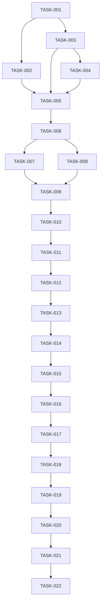

# Backlog executável — Tropa Fight

Estados permitidos: `BLOCKED | READY | IN_PROGRESS | IN_REVIEW | DONE | FAILED | CANCELLED`.

Toda TASK herda a DoD global de `AGENTS.md`: build, lint e testes aplicáveis aprovados, critérios atendidos, rastreabilidade preservada, Scope Guard validado e estado atualizado.

Política incidental padrão:

`MINIMAL_DIRECTLY_CAUSED_CHANGES_ALLOWED`

Nenhuma TASK pode iniciar automaticamente outra TASK após sua conclusão.

## Índice de execução

| Ordem | TASK     | Fase     | Prioridade | Dependências               | Estado  |
| ----: | -------- | -------- | ---------- | -------------------------- | ------- |
|     1 | TASK-001 | PHASE-01 | CRITICAL   | NONE                       | READY   |
|     2 | TASK-002 | PHASE-01 | HIGH       | TASK-001                   | BLOCKED |
|     3 | TASK-003 | PHASE-01 | CRITICAL   | TASK-001                   | BLOCKED |
|     4 | TASK-004 | PHASE-01 | HIGH       | TASK-003                   | BLOCKED |
|     5 | TASK-005 | PHASE-01 | HIGH       | TASK-002,TASK-003,TASK-004 | BLOCKED |
|     6 | TASK-006 | PHASE-02 | CRITICAL   | TASK-005                   | BLOCKED |
|     7 | TASK-007 | PHASE-02 | HIGH       | TASK-006                   | BLOCKED |
|     8 | TASK-008 | PHASE-02 | HIGH       | TASK-006                   | BLOCKED |
|     9 | TASK-009 | PHASE-02 | HIGH       | TASK-007,TASK-008          | BLOCKED |
|    10 | TASK-010 | PHASE-02 | HIGH       | TASK-009                   | BLOCKED |
|    11 | TASK-011 | PHASE-03 | CRITICAL   | TASK-010                   | BLOCKED |
|    12 | TASK-012 | PHASE-03 | HIGH       | TASK-011                   | BLOCKED |
|    13 | TASK-013 | PHASE-03 | CRITICAL   | TASK-012                   | BLOCKED |
|    14 | TASK-014 | PHASE-03 | HIGH       | TASK-013                   | BLOCKED |
|    15 | TASK-015 | PHASE-03 | HIGH       | TASK-014                   | BLOCKED |
|    16 | TASK-016 | PHASE-03 | HIGH       | TASK-015                   | BLOCKED |
|    17 | TASK-017 | PHASE-04 | CRITICAL   | TASK-016                   | BLOCKED |
|    18 | TASK-018 | PHASE-04 | HIGH       | TASK-017                   | BLOCKED |
|    19 | TASK-019 | PHASE-04 | HIGH       | TASK-018                   | BLOCKED |
|    20 | TASK-020 | PHASE-04 | HIGH       | TASK-019                   | BLOCKED |
|    21 | TASK-021 | PHASE-04 | HIGH       | TASK-020                   | BLOCKED |
|    22 | TASK-022 | PHASE-04 | HIGH       | TASK-021                   | BLOCKED |

---

## TASK-001 — Inicializar aplicação e fundação de qualidade

**Status:** READY
**Phase/Priority:** PHASE-01 / CRITICAL
**Dependências:** `DEPENDS_ON: NONE`
**Relacionados:** RNF-001, RNF-002, RNF-013, ADR-001, ADR-002
**Objetivo:** Criar o esqueleto executável do Tropa Fight, separação inicial de camadas, configuração local, lint, testes e convenções básicas, sem implementar funcionalidades comerciais.
**Artefatos esperados:** Aplicação compilável, estrutura Presentation/Application/Domain/Infrastructure, configuração de testes, lint e instruções de execução local.
**ALLOWED_CHANGES:** arquivos de configuração na raiz; `src/**`; `tests/**`; configuração de qualidade; documentação operacional mínima; `TASKS.md`.
**FORBIDDEN_CHANGES:** regras de negócio, checkout, pagamentos, catálogo comercial, integrações externas reais, migrations de domínio.
**Critérios de aceitação/Testes:** build passa; lint passa; teste de exemplo passa; dependências entre camadas respeitam a arquitetura aprovada.
**DoD específico:** execução local reproduzível e comandos de qualidade documentados.

## TASK-002 — Definir infraestrutura, ambientes e observabilidade

**Status:** BLOCKED
**Phase/Priority:** PHASE-01 / HIGH
**Dependências:** `DEPENDS_ON: TASK-001`
**Relacionados:** RNF-011, RNF-012, RNF-018, PD-001, PD-002, PD-003, PD-004, ADR-003
**Objetivo:** Definir ambientes, estratégia de configuração, segredos, persistência, backups, monitoramento e recuperação.
**Artefatos esperados:** ADRs necessários, documentação de ambientes, estratégia de backup/restore, observabilidade e configuração.
**ALLOWED_CHANGES:** `docs/adr/**`; `docs/architecture/**`; configuração de ambientes; infraestrutura de desenvolvimento/homologação; `TASKS.md`.
**FORBIDDEN_CHANGES:** credenciais reais, produção sem aprovação, código comercial, decisões não aprovadas sobre provedores.
**Critérios de aceitação/Testes:** decisões de infraestrutura registradas; estratégia de backup e restauração definida; RPO/RTO documentados ou explicitamente pendentes.
**DoD específico:** nenhuma decisão crítica de infraestrutura permanece oculta.

**Bloqueio:** decisões de provedores e ambientes ainda precisam ser aprovadas.

## TASK-003 — Identidade, autenticação e autorização

**Status:** BLOCKED
**Phase/Priority:** PHASE-01 / CRITICAL
**Dependências:** `DEPENDS_ON: TASK-001`
**Relacionados:** RF-001, RN-001, RN-002, RNF-004, RNF-005, UC-001, ADR-004
**Objetivo:** Implementar cadastro, login, logout, recuperação de acesso, perfil, sessões e base de autorização.
**Artefatos esperados:** User, Customer, AdminUser, roles/permissions, autenticação e guardas de autorização.
**ALLOWED_CHANGES:** módulos de identidade/autenticação/autorização; persistência correspondente; testes; `TASKS.md`.
**FORBIDDEN_CHANGES:** catálogo, carrinho, checkout, pagamento, estoque comercial.
**Critérios de aceitação/Testes:** autenticação funciona; senha não é armazenada em texto puro; usuário só acessa recursos autorizados; rotas administrativas exigem autorização adequada.
**DoD específico:** testes unitários e de API de autenticação/RBAC passam.

## TASK-004 — Auditoria, privacidade e notificações base

**Status:** BLOCKED
**Phase/Priority:** PHASE-01 / HIGH
**Dependências:** `DEPENDS_ON: TASK-003`
**Relacionados:** RF-023, RF-024, RF-026, RNF-006, RNF-007, RNF-008
**Objetivo:** Criar fundações para auditoria, privacidade e notificações desacopladas.
**Artefatos esperados:** AuditLog, abstração de notificações, eventos básicos e controles de acesso administrativo.
**ALLOWED_CHANGES:** módulos de audit/notifications/privacy; persistência correspondente; testes; `TASKS.md`.
**FORBIDDEN_CHANGES:** políticas jurídicas inventadas, exclusão definitiva sem regra aprovada, integrações reais de e-mail sem decisão.
**Critérios de aceitação/Testes:** ações administrativas relevantes podem ser auditadas; segredos não aparecem em logs; notificações possuem abstração substituível.
**DoD específico:** tratamento de dados pessoais segue os requisitos aprovados.

## TASK-005 — Checkpoint PHASE-01

**Status:** BLOCKED
**Phase/Priority:** PHASE-01 / HIGH
**Dependências:** `DEPENDS_ON: TASK-002,TASK-003,TASK-004`
**Relacionados:** RNF-001–018, ADR-001–004
**Objetivo:** Validar fundação técnica, segurança, decisões arquiteturais, infraestrutura e rastreabilidade.
**Artefatos esperados:** relatório de checkpoint, correções estritamente necessárias e atualização de rastreabilidade.
**ALLOWED_CHANGES:** testes, documentação, configuração e correções necessárias da PHASE-01; `TASKS.md`.
**FORBIDDEN_CHANGES:** funcionalidades comerciais das fases seguintes.
**Critérios de aceitação/Testes:** build/lint/testes passam; decisões críticas estão registradas; nenhum bloqueio relevante foi ignorado.
**DoD específico:** PHASE-02 torna-se elegível.

---

## TASK-006 — Catálogo de produtos e categorias

**Status:** BLOCKED
**Phase/Priority:** PHASE-02 / CRITICAL
**Dependências:** `DEPENDS_ON: TASK-005`
**Relacionados:** RF-003, RF-004, RF-005, RF-006, RF-020, UC-002, UC-009
**Objetivo:** Criar o domínio de produtos, categorias, marcas e informações comerciais básicas.
**Artefatos esperados:** Product, Category, Brand, CRUD administrativo e catálogo público.
**ALLOWED_CHANGES:** módulos catalog/categories/brands; persistência; APIs; testes; `TASKS.md`.
**FORBIDDEN_CHANGES:** checkout, pagamento, pedidos, promoções complexas.
**Critérios de aceitação/Testes:** produtos podem ser criados/editados conforme autorização; categorias e marcas são associáveis; catálogo público não expõe produtos que não devem ser publicados.
**DoD específico:** APIs e testes de autorização concluídos.

## TASK-007 — Variantes, preços e disponibilidade

**Status:** BLOCKED
**Phase/Priority:** PHASE-02 / HIGH
**Dependências:** `DEPENDS_ON: TASK-006`
**Relacionados:** RF-007, RF-008, RF-021, RN-004, RN-005, UC-003
**Objetivo:** Implementar variantes de produtos, preços e disponibilidade comercial.
**Artefatos esperados:** ProductVariant, atributos de variante, preço e relacionamento com estoque.
**ALLOWED_CHANGES:** módulos catalog/variants/pricing; persistência; APIs; testes; `TASKS.md`.
**FORBIDDEN_CHANGES:** reserva definitiva de estoque no checkout, pagamentos, transportadoras.
**Critérios de aceitação/Testes:** variantes são identificáveis individualmente; preço corresponde à variante; produto sem disponibilidade não pode ser vendido indevidamente.
**DoD específico:** testes de combinação, preço e disponibilidade passam.

## TASK-008 — Busca, filtros, ordenação e experiência de catálogo

**Status:** BLOCKED
**Phase/Priority:** PHASE-02 / HIGH
**Dependências:** `DEPENDS_ON: TASK-006`
**Relacionados:** RF-009, RF-010, RF-011, RF-012, UC-002, UC-003
**Objetivo:** Expor busca, filtros, ordenação e navegação do catálogo.
**Artefatos esperados:** endpoints/UI de busca, filtros por categoria/marca/preço e paginação.
**ALLOWED_CHANGES:** módulos catalog/search; testes; contratos API/UI; `TASKS.md`.
**FORBIDDEN_CHANGES:** recomendação por IA, checkout, wishlist, avaliações.
**Critérios de aceitação/Testes:** filtros combinados retornam resultados corretos; paginação é consistente; ordenação respeita critérios definidos.
**DoD específico:** testes de API e acessibilidade dos controles aplicáveis.

## TASK-009 — Estoque e movimentações

**Status:** BLOCKED
**Phase/Priority:** PHASE-02 / HIGH
**Dependências:** `DEPENDS_ON: TASK-007,TASK-008`
**Relacionados:** RF-013, RF-014, RN-006, RN-007, UC-010, ADR-005
**Objetivo:** Implementar estoque, movimentações e controles administrativos de inventário.
**Artefatos esperados:** Inventory, InventoryMovement, ajustes, entradas, saídas e consulta de saldo.
**ALLOWED_CHANGES:** módulos inventory/stock; persistência; APIs administrativas; testes; `TASKS.md`.
**FORBIDDEN_CHANGES:** pagamento, logística externa, reserva de checkout não especificada.
**Critérios de aceitação/Testes:** saldo é consistente; movimentações são auditáveis; alterações respeitam autorização; concorrência não produz saldo negativo indevido.
**DoD específico:** testes de integridade e concorrência aplicáveis passam.

## TASK-010 — Checkpoint PHASE-02

**Status:** BLOCKED
**Phase/Priority:** PHASE-02 / HIGH
**Dependências:** `DEPENDS_ON: TASK-009`
**Relacionados:** RF-003–014, RN-004–007, UC-002, UC-003, UC-010
**Objetivo:** Validar catálogo, variantes, busca e estoque.
**Artefatos esperados:** relatório de checkpoint, testes integrados e rastreabilidade atualizada.
**ALLOWED_CHANGES:** testes, documentação, configuração e correções necessárias da PHASE-02; `TASKS.md`.
**FORBIDDEN_CHANGES:** checkout, pagamento e pedidos.
**Critérios de aceitação/Testes:** build/lint/unit/integration/API passam; catálogo e estoque mantêm integridade.
**DoD específico:** PHASE-03 torna-se elegível.

---

## TASK-011 — Carrinho e cálculo comercial

**Status:** BLOCKED
**Phase/Priority:** PHASE-03 / CRITICAL
**Dependências:** `DEPENDS_ON: TASK-010`
**Relacionados:** RF-015, RF-016, RF-017, RN-008, RN-009, UC-004
**Objetivo:** Implementar carrinho, itens, quantidades, subtotal e regras comerciais aprovadas.
**Artefatos esperados:** Cart, CartItem, cálculo determinístico e persistência adequada.
**ALLOWED_CHANGES:** módulos cart/pricing; persistência; testes; `TASKS.md`.
**FORBIDDEN_CHANGES:** captura de pagamento, integração real com gateway, política de reembolso.
**Critérios de aceitação/Testes:** quantidades inválidas são rejeitadas; itens indisponíveis não podem ser adicionados/confirmados indevidamente; subtotal é consistente.
**DoD específico:** invariantes de cálculo cobertas por testes unitários e de integração.

## TASK-012 — Cupons e promoções

**Status:** BLOCKED
**Phase/Priority:** PHASE-03 / HIGH
**Dependências:** `DEPENDS_ON: TASK-011`
**Relacionados:** RF-018, RF-019, RN-010, UC-005
**Objetivo:** Implementar cupons e promoções conforme regras aprovadas.
**Artefatos esperados:** Coupon, Promotion, validação de vigência, limites e aplicação de desconto.
**ALLOWED_CHANGES:** módulos promotions/coupons/pricing; testes; APIs; `TASKS.md`.
**FORBIDDEN_CHANGES:** inventar política comercial, alterar preço de catálogo sem autorização, pagamento.
**Critérios de aceitação/Testes:** cupom expirado ou inválido não é aplicado; limites de uso são respeitados; desconto é calculado de forma determinística.
**DoD específico:** regras de desconto cobertas por testes.

## TASK-013 — Checkout, endereço e frete

**Status:** BLOCKED
**Phase/Priority:** PHASE-03 / CRITICAL
**Dependências:** `DEPENDS_ON: TASK-012`
**Relacionados:** RF-020, RF-021, RF-022, RF-023, RN-011, RN-012, UC-006
**Objetivo:** Implementar checkout, endereços, cálculo/seleção de entrega e criação de pedido.
**Artefatos esperados:** Address, Order, OrderItem, Shipment e fluxo transacional de checkout.
**ALLOWED_CHANGES:** módulos checkout/orders/shipping; persistência; APIs; testes; `TASKS.md`.
**FORBIDDEN_CHANGES:** gateway real sem aprovação, regras de devolução não definidas, integrações logísticas não aprovadas.
**Critérios de aceitação/Testes:** endereço pertence ao cliente; pedido preserva preço/itens no momento da compra; estoque é validado de forma consistente; checkout inválido não cria pedido parcial.
**DoD específico:** testes transacionais e de concorrência aplicáveis passam.

## TASK-014 — Pagamentos e idempotência

**Status:** BLOCKED
**Phase/Priority:** PHASE-03 / HIGH
**Dependências:** `DEPENDS_ON: TASK-013`
**Relacionados:** RF-024, RF-025, RN-013, RNF-009, ADR-006
**Objetivo:** Integrar o provedor de pagamento aprovado e persistir estados de pagamento de forma idempotente.
**Artefatos esperados:** Payment, adaptador de gateway, webhooks e tratamento de estados.
**ALLOWED_CHANGES:** módulos payments/orders; adaptador do provedor aprovado; mocks; testes; `TASKS.md`.
**FORBIDDEN_CHANGES:** credenciais reais no código, troca unilateral de gateway, alteração de preço após pagamento.
**Critérios de aceitação/Testes:** webhook repetido não duplica efeitos; assinatura inválida é rejeitada; pagamento possui estado consistente com pedido.
**DoD específico:** testes de webhook e idempotência passam.

## TASK-015 — Pedidos, histórico e rastreamento

**Status:** BLOCKED
**Phase/Priority:** PHASE-03 / HIGH
**Dependências:** `DEPENDS_ON: TASK-014`
**Relacionados:** RF-026, RF-027, RF-028, RN-014, UC-007, UC-008
**Objetivo:** Disponibilizar histórico de pedidos, detalhes, estados e acompanhamento.
**Artefatos esperados:** APIs/UI de pedidos, histórico, status e rastreamento.
**ALLOWED_CHANGES:** módulos orders/shipping/customer-area; testes; `TASKS.md`.
**FORBIDDEN_CHANGES:** inventar política de cancelamento/devolução, alterar fluxo de pagamento sem ADR.
**Critérios de aceitação/Testes:** cliente só acessa seus próprios pedidos; administrador acessa conforme permissão; transições inválidas de estado são rejeitadas.
**DoD específico:** matriz de estados e testes de autorização concluídos.

## TASK-016 — Checkpoint PHASE-03

**Status:** BLOCKED
**Phase/Priority:** PHASE-03 / HIGH
**Dependências:** `DEPENDS_ON: TASK-015`
**Relacionados:** RF-015–028, RN-008–014, UC-004–008
**Objetivo:** Validar o fluxo comercial ponta a ponta.
**Artefatos esperados:** cenário completo de compra, pagamento, pedido e rastreamento; relatório de checkpoint.
**ALLOWED_CHANGES:** testes, configuração, documentação e correções necessárias da PHASE-03; `TASKS.md`.
**FORBIDDEN_CHANGES:** novas funcionalidades administrativas da PHASE-04.
**Critérios de aceitação/Testes:** carrinho → checkout → pagamento → pedido → histórico/rastreamento funciona; idempotência e integridade passam.
**DoD específico:** PHASE-04 torna-se elegível.

---

## TASK-017 — Avaliações e favoritos

**Status:** BLOCKED
**Phase/Priority:** PHASE-04 / CRITICAL
**Dependências:** `DEPENDS_ON: TASK-016`
**Relacionados:** RF-029, RF-030, RN-015, RN-016, UC-009
**Objetivo:** Implementar avaliações de produtos e favoritos/wishlist.
**Artefatos esperados:** Review, Favorite e operações públicas/privadas correspondentes.
**ALLOWED_CHANGES:** módulos reviews/favorites/customer-area; testes; `TASKS.md`.
**FORBIDDEN_CHANGES:** sistema social, chat interno, recomendações algorítmicas.
**Critérios de aceitação/Testes:** cliente só pode avaliar conforme regra aprovada; usuário só acessa seus favoritos; avaliações inválidas não são publicadas.
**DoD específico:** autorização e regras de publicação testadas.

## TASK-018 — Administração de catálogo, estoque e pedidos

**Status:** BLOCKED
**Phase/Priority:** PHASE-04 / HIGH
**Dependências:** `DEPENDS_ON: TASK-017`
**Relacionados:** RF-031, RF-032, RF-033, RF-034, UC-010–UC-013
**Objetivo:** Consolidar operações administrativas sobre produtos, estoque, pedidos e clientes.
**Artefatos esperados:** painel administrativo, filtros, operações autorizadas e visão operacional.
**ALLOWED_CHANGES:** módulos admin/catalog/inventory/orders/customers; testes; `TASKS.md`.
**FORBIDDEN_CHANGES:** permissões não aprovadas, alteração unilateral de RBAC, funcionalidades de ERP.
**Critérios de aceitação/Testes:** cada função administrativa respeita permissões; operações críticas são auditadas; clientes não acessam recursos administrativos.
**DoD específico:** testes RBAC e fluxos administrativos passam.

## TASK-019 — Cupons, avaliações e usuários administrativos

**Status:** BLOCKED
**Phase/Priority:** PHASE-04 / HIGH
**Dependências:** `DEPENDS_ON: TASK-018`
**Relacionados:** RF-035, RF-036, RF-037, RF-038, RN-017, UC-014
**Objetivo:** Completar administração de promoções, avaliações e usuários administrativos.
**Artefatos esperados:** gestão de cupons, moderação de avaliações e gestão de administradores/roles.
**ALLOWED_CHANGES:** módulos admin/promotions/reviews/users; testes; `TASKS.md`.
**FORBIDDEN_CHANGES:** criação de novos papéis sem decisão; bypass de autorização; exclusão de histórico de auditoria.
**Critérios de aceitação/Testes:** apenas usuários autorizados administram usuários; avaliações moderadas deixam rastros; operações críticas são auditadas.
**DoD específico:** RBAC, auditoria e testes de autorização completos.

## TASK-020 — Notificações, auditoria e observabilidade

**Status:** BLOCKED
**Phase/Priority:** PHASE-04 / HIGH
**Dependências:** `DEPENDS_ON: TASK-019`
**Relacionados:** RF-026, RF-038, RNF-006, RNF-011, RNF-012, UC-015
**Objetivo:** Integrar notificações necessárias, consolidar auditoria e preparar observabilidade operacional.
**Artefatos esperados:** eventos/notificações, logs estruturados, métricas, health checks e auditoria.
**ALLOWED_CHANGES:** módulos notifications/audit/observability; configuração operacional; testes; `TASKS.md`.
**FORBIDDEN_CHANGES:** registrar segredos, criar canais não aprovados, alterar regras comerciais.
**Critérios de aceitação/Testes:** eventos relevantes geram notificações previstas; falhas relevantes são observáveis; dados sensíveis não aparecem indevidamente nos logs.
**DoD específico:** health checks, logs e métricas essenciais validados.

## TASK-021 — Segurança, acessibilidade e testes E2E

**Status:** BLOCKED
**Phase/Priority:** PHASE-04 / HIGH
**Dependências:** `DEPENDS_ON: TASK-020`
**Relacionados:** RNF-003, RNF-004, RNF-005, RNF-006, RNF-014, UC-001–UC-015
**Objetivo:** Executar validação transversal de segurança, acessibilidade, responsividade e fluxos ponta a ponta.
**Artefatos esperados:** testes E2E, verificações de acessibilidade, validações de autorização e relatório de segurança.
**ALLOWED_CHANGES:** UI, testes E2E/a11y, configuração de qualidade e correções diretamente necessárias; `TASKS.md`.
**FORBIDDEN_CHANGES:** alteração de requisitos, mudança arquitetural, novas funcionalidades comerciais.
**Critérios de aceitação/Testes:** fluxos críticos funcionam em desktop/mobile; controles essenciais são acessíveis; autorização é validada; regressões críticas não permanecem.
**DoD específico:** resultados dos testes registrados e problemas críticos resolvidos ou formalmente bloqueados.

## TASK-022 — Checkpoint PHASE-04 e readiness de lançamento

**Status:** BLOCKED
**Phase/Priority:** PHASE-04 / HIGH
**Dependências:** `DEPENDS_ON: TASK-021`
**Relacionados:** todos os RF/RN/RNF/UC/ADR aplicáveis
**Objetivo:** Executar a validação final da V1, incluindo arquitetura, segurança, dados, backup, observabilidade, testes e rastreabilidade.
**Artefatos esperados:** checklist de release, relatório final de Quality Gates, matriz de riscos e rastreabilidade atualizada.
**ALLOWED_CHANGES:** testes, configuração de release, documentação operacional e `TASKS.md`.
**FORBIDDEN_CHANGES:** funcionalidades novas, alterações de escopo, atalhos de segurança, mudança arquitetural não aprovada.
**Critérios de aceitação/Testes:** todos os Gates aplicáveis passam; backup/restauração é verificável; autenticação/autorização estão validadas; pagamentos/webhooks são consistentes; rastreabilidade está completa.
**DoD específico:** V1 pronta para decisão de lançamento, com todas as pendências restantes explicitamente registradas e aceitas.

---

# Definition of Done global

Toda TASK deve cumprir, além do DoD específico:

* critérios de aceitação atendidos;
* build aprovado;
* lint aprovado;
* testes aplicáveis aprovados;
* documentação exigida atualizada;
* rastreabilidade preservada;
* `ALLOWED_CHANGES` respeitado;
* `FORBIDDEN_CHANGES` não violado;
* alterações incidentais justificadas;
* nenhum Scope Creep;
* `TASKS.md` atualizado;
* estado final corretamente registrado;
* relatório de execução produzido.

# Checkpoints de fase

## PHASE-01 — Fundação

Saída esperada:

```text
TASK-001 → TASK-002/TASK-003/TASK-004 → TASK-005
```

A fase deve entregar:

* estrutura inicial;
* qualidade automatizada;
* arquitetura inicial documentada;
* identidade;
* autorização;
* auditoria;
* fundamentos de privacidade;
* infraestrutura definida;
* observabilidade inicial;
* decisões críticas registradas.

## PHASE-02 — Catálogo e estoque

Saída esperada:

```text
TASK-006 → TASK-007/TASK-008 → TASK-009 → TASK-010
```

A fase deve entregar:

* produtos;
* categorias;
* marcas;
* variantes;
* preços;
* busca;
* filtros;
* estoque;
* movimentações;
* controles de integridade.

## PHASE-03 — Comércio

Saída esperada:

```text
TASK-011 → TASK-012 → TASK-013 → TASK-014 → TASK-015 → TASK-016
```

A fase deve entregar:

* carrinho;
* promoções;
* checkout;
* endereços;
* frete;
* pedidos;
* pagamento;
* webhooks;
* histórico;
* rastreamento.

## PHASE-04 — Administração e readiness

Saída esperada:

```text
TASK-017 → TASK-018 → TASK-019 → TASK-020 → TASK-021 → TASK-022
```

A fase deve entregar:

* avaliações;
* favoritos;
* administração;
* usuários administrativos;
* notificações;
* auditoria;
* observabilidade;
* segurança;
* acessibilidade;
* E2E;
* validação final.

# Grafo de dependências



# Ordem topológica

A ordem mínima de execução é:

```text
TASK-001
TASK-002
TASK-003
TASK-004
TASK-005
TASK-006
TASK-007
TASK-008
TASK-009
TASK-010
TASK-011
TASK-012
TASK-013
TASK-014
TASK-015
TASK-016
TASK-017
TASK-018
TASK-019
TASK-020
TASK-021
TASK-022
```

Uma TASK só pode entrar em `IN_PROGRESS` quando estiver `READY`, todas as dependências estiverem `DONE` e sua Definition of Ready estiver satisfeita.

# Política de execução

* Nunca iniciar uma TASK `BLOCKED`.
* Nunca iniciar mais de uma TASK como `IN_PROGRESS` sem autorização explícita.
* Nunca marcar `DONE` com Gate obrigatório falhando.
* Nunca ignorar dependência para acelerar execução.
* Nunca alterar TASK futura como consequência automática da TASK atual.
* Nunca criar funcionalidades fora do escopo para "aproveitar" uma alteração.
* Toda mudança arquitetural relevante exige ADR.
* Toda mudança de requisito exige decisão explícita.
* Toda alteração de contrato deve possuir rastreabilidade.
* Todo bloqueio relevante deve ser registrado.
* Ao finalizar uma TASK, parar e aguardar autorização para a próxima.
