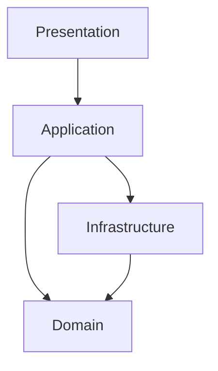

# Plano de Desenvolvimento — Tropa Fight

**Versão:** 1.0
**Status:** PLANEJAMENTO EM DEFINIÇÃO
**Tipo:** Plano de desenvolvimento de software
**Metodologia:** Desenvolvimento incremental orientado a requisitos, dependências e TASKs
**Arquitetura definida:** Arquitetura em camadas
**Implementação:** Não iniciada neste plano

---

# 1. Visão geral do projeto

## 1.1 Problema

A ausência de uma plataforma centralizada, responsiva e segura para comercialização de produtos físicos de artes marciais, esportes de combate e treinamento dificulta a descoberta de produtos, a experiência de compra e a gestão operacional do negócio.

## 1.2 Objetivo

Desenvolver o Tropa Fight, uma plataforma de e-commerce voltada ao público brasileiro, permitindo que clientes descubram, avaliem e comprem produtos de combate e treinamento, enquanto administradores gerenciam catálogo, estoque, pedidos, clientes e operações comerciais.

## 1.3 Princípios do desenvolvimento

* Planejar antes de implementar.
* Priorizar integridade de estoque, pedidos e pagamentos.
* Desenvolver de forma incremental.
* Manter arquitetura em camadas.
* Não inventar regras de negócio.
* Manter rastreabilidade entre requisitos, testes e TASKs.
* Evitar dependências tecnológicas sem justificativa.
* Não iniciar TASK bloqueada.
* Não ampliar escopo sem autorização.
* Não considerar uma TASK concluída sem validação.

---

# 2. Escopo preliminar

## 2.1 Funcionalidades previstas

### Área do cliente

* Cadastro, autenticação e recuperação de senha.
* Confirmação de e-mail.
* Perfil e gerenciamento de endereços.
* Catálogo de produtos.
* Pesquisa, filtros e ordenação.
* Detalhes e variantes de produtos.
* Carrinho de compras.
* Cupons e promoções.
* Estimativa de frete.
* Checkout e pagamento.
* Histórico e acompanhamento de pedidos.
* Lista de favoritos.
* Avaliações de produtos.
* Notificações relacionadas à conta e aos pedidos.

### Área administrativa

* Painel básico de vendas.
* Gerenciamento de produtos, categorias e marcas.
* Gerenciamento de variantes.
* Controle de estoque e movimentações.
* Gerenciamento de pedidos.
* Gerenciamento de clientes.
* Cupons e promoções.
* Moderação de avaliações.
* Gerenciamento de usuários administrativos e permissões.
* Logs e auditoria das operações relevantes.

### Base técnica

* Banco de dados e persistência.
* Autenticação e autorização.
* Integrações externas.
* Validação de dados.
* Tratamento de erros.
* Testes automatizados.
* Logs e monitoramento.
* Backups e recuperação.
* Segurança e privacidade.

## 2.2 Fora de escopo preliminar

Os itens abaixo não deverão ser implementados sem decisão e aprovação explícitas:

* Marketplace com múltiplos vendedores.
* Assinaturas e aluguel de produtos.
* Programa de afiliados.
* Clube de fidelidade.
* Chat ou rede social interna.
* Inteligência artificial para recomendação.
* BI avançado.
* Expansão internacional e múltiplas moedas.
* Integrações extensas com ERP.
* Aplicativo nativo independente, enquanto a estratégia mobile não estiver definida.

---

# 3. Decisões e pendências críticas

| ID     | Decisão pendente                                  | Impacto                       |
| ------ | ------------------------------------------------- | ----------------------------- |
| PD-001 | Categorias exatas de produtos da V1               | Catálogo e requisitos         |
| PD-002 | Atributos e variantes, como tamanho e cor         | Modelo de domínio e estoque   |
| PD-003 | Regras de reserva, baixa e reposição de estoque   | Concorrência e pedidos        |
| PD-004 | Gateway e meios de pagamento definitivos          | Checkout e integração         |
| PD-005 | Transportadoras e cálculo de frete                | Checkout e logística          |
| PD-006 | Política de troca, devolução e reembolso          | Pedidos e atendimento         |
| PD-007 | Emissão de nota fiscal na V1                      | Operação e obrigações fiscais |
| PD-008 | Estratégia mobile: web responsiva, PWA ou app     | Arquitetura e escopo          |
| PD-009 | Stack tecnológica                                 | Arquitetura e infraestrutura  |
| PD-010 | Hospedagem, ambientes e deploy                    | Infraestrutura                |
| PD-011 | Metas mensuráveis de desempenho e disponibilidade | RNFs e testes                 |
| PD-012 | Regras definitivas de cupons e promoções          | Checkout e domínio            |
| PD-013 | Política de avaliações e moderação                | Reputação e administração     |
| PD-014 | Campos obrigatórios e retenção de dados           | Cadastro, LGPD e segurança    |

As pendências devem ser resolvidas durante a elicitação ou formalmente mantidas como decisões futuras não bloqueantes.

---

# 4. Arquitetura e organização

## 4.1 Arquitetura proposta

O projeto utilizará arquitetura em camadas, conforme decisão já estabelecida.



A estrutura definitiva, as dependências permitidas entre camadas, os módulos e as tecnologias serão formalizados na documentação arquitetural e nos ADRs.

## 4.2 Artefatos do projeto

```text
project-root/
├── README.md
├── AGENTS.md
├── TASKS.md
└── docs/
    ├── adr/
    ├── architecture/
    └── diagrams/
```

| Artefato           | Responsabilidade                                        |
| ------------------ | ------------------------------------------------------- |
| README.md          | O que construir e por quê                               |
| AGENTS.md          | Como o agente deve trabalhar                            |
| TASKS.md           | O que executar, em qual ordem e dentro de quais limites |
| docs/adr/          | Decisões arquiteturais e justificativas                 |
| docs/architecture/ | Detalhamento da arquitetura                             |
| docs/diagrams/     | Diagramas do sistema                                    |
| Código e testes    | Implementação aprovada                                  |

---

# 5. Roadmap de desenvolvimento

## PHASE-01 — Consolidação de requisitos e planejamento

**Objetivo:** Eliminar lacunas relevantes antes da implementação.

**Entregáveis:**

* Elicitação consolidada.
* Escopo da V1 aprovado.
* Requisitos funcionais e não funcionais.
* Regras de negócio.
* Casos de uso.
* Modelo conceitual inicial.
* Pendências e riscos documentados.
* README.md, AGENTS.md e TASKS.md revisados.
* ADRs iniciais necessários.

**Critério de conclusão:** Requisitos e decisões suficientes para iniciar a arquitetura detalhada e a implementação, com aprovação explícita.

## PHASE-02 — Arquitetura e fundação técnica

**Objetivo:** Estabelecer a estrutura técnica do sistema.

**Entregáveis:**

* Stack tecnológica aprovada.
* Estrutura de diretórios.
* Configuração de ambientes.
* Convenções de código.
* Estratégia de configuração e segredos.
* Persistência inicial.
* Estratégia de testes.
* Pipeline de qualidade inicial.

**Critério de conclusão:** A fundação técnica deve ser compilável, testável e documentada, sem funcionalidades comerciais não autorizadas.

## PHASE-03 — Identidade, acesso e clientes

**Objetivo:** Implementar os fundamentos de identidade e acesso.

**Entregáveis:**

* Cadastro e autenticação.
* Confirmação de e-mail.
* Recuperação de senha.
* Perfil e endereços.
* Papéis e permissões iniciais.
* Testes de autenticação e autorização.

**Critério de conclusão:** Os fluxos de identidade aprovados funcionam com validação, tratamento de erros e testes.

## PHASE-04 — Catálogo e descoberta de produtos

**Objetivo:** Disponibilizar produtos e permitir sua descoberta.

**Entregáveis:**

* Categorias e marcas.
* Produtos e variantes.
* Detalhes de produto.
* Pesquisa, filtros e ordenação.
* Cadastro e edição administrativa.
* Importação CSV, conforme regras aprovadas.
* Testes de catálogo e validação.

**Critério de conclusão:** O catálogo apresenta dados consistentes e respeita as regras de publicação e disponibilidade.

## PHASE-05 — Estoque e integridade comercial

**Objetivo:** Garantir controle confiável de disponibilidade dos produtos.

**Entregáveis:**

* Estoque por produto ou variante, conforme decisão aprovada.
* Movimentações de estoque.
* Regras de baixa e reserva.
* Alertas de estoque baixo.
* Proteção contra venda acima da disponibilidade.
* Testes de concorrência e integridade.

**Critério de conclusão:** As operações de estoque respeitam as invariantes aprovadas e não permitem inconsistências conhecidas.

## PHASE-06 — Carrinho, cupons e checkout

**Objetivo:** Permitir a formação e validação de compras.

**Entregáveis:**

* Carrinho.
* Cálculo de subtotal.
* Aplicação e validação de cupons.
* Regras de preço e promoção.
* Estimativa de frete.
* Validação de disponibilidade.
* Criação do pedido.
* Testes de regras comerciais.

**Critério de conclusão:** O checkout respeita preços, cupons, disponibilidade e demais regras aprovadas.

## PHASE-07 — Pagamentos e ciclo de pedidos

**Objetivo:** Integrar pagamentos e gerenciar o ciclo de vida dos pedidos.

**Entregáveis:**

* Integração com gateway aprovado.
* Processamento de eventos/webhooks.
* Idempotência de eventos.
* Estados de pagamento e pedido.
* Cancelamentos e reembolsos conforme política aprovada.
* Histórico de pedidos.
* Testes de falha, repetição e inconsistência.

**Critério de conclusão:** O sistema processa os estados de pedido e pagamento de forma consistente e rastreável.

## PHASE-08 — Logística e acompanhamento

**Objetivo:** Integrar os fluxos de entrega física.

**Entregáveis:**

* Integração logística aprovada.
* Cálculo definitivo de frete, conforme contrato.
* Dados de envio.
* Atualização de status.
* Código ou link de rastreamento, quando disponível.
* Testes de integração e falhas logísticas.

**Critério de conclusão:** O cliente e a administração conseguem acompanhar os estados de envio definidos para a V1.

## PHASE-09 — Recursos complementares e administração

**Objetivo:** Completar a experiência comercial e as operações administrativas.

**Entregáveis:**

* Favoritos.
* Avaliações e moderação.
* Notificações.
* Gerenciamento administrativo de clientes.
* Painel básico de vendas.
* Cupons e promoções administrativos.
* Auditoria das operações críticas.

**Critério de conclusão:** Os recursos aprovados funcionam com permissões e regras de negócio verificadas.

## PHASE-10 — Segurança, validação e preparação para lançamento

**Objetivo:** Validar a solução integrada antes da disponibilização.

**Entregáveis:**

* Testes end-to-end.
* Testes de regressão.
* Revisão de segurança.
* Validação de acessibilidade.
* Testes de desempenho.
* Logs e monitoramento.
* Backups e recuperação testados.
* Configuração dos ambientes de produção.
* Documentação operacional.

**Critério de conclusão:** Os Quality Gates obrigatórios passam, os riscos críticos estão tratados e o lançamento possui aprovação explícita.

---

# 6. Backlog macro e dependências

Os itens abaixo representam unidades macro de planejamento. A decomposição final em TASKs executáveis deverá ocorrer após a consolidação dos requisitos e dos contratos técnicos.

| Ordem | TASK macro                                         | Fase     | Dependência        |
| ----: | -------------------------------------------------- | -------- | ------------------ |
|     1 | TASK-001 — Consolidar requisitos e pendências      | PHASE-01 | NONE               |
|     2 | TASK-002 — Aprovar arquitetura e decisões iniciais | PHASE-01 | TASK-001           |
|     3 | TASK-003 — Checkpoint de planejamento              | PHASE-01 | TASK-002           |
|     4 | TASK-004 — Criar fundação técnica                  | PHASE-02 | TASK-003           |
|     5 | TASK-005 — Implementar identidade e acesso         | PHASE-03 | TASK-004           |
|     6 | TASK-006 — Implementar catálogo                    | PHASE-04 | TASK-005           |
|     7 | TASK-007 — Implementar estoque                     | PHASE-05 | TASK-006           |
|     8 | TASK-008 — Implementar carrinho e checkout         | PHASE-06 | TASK-007           |
|     9 | TASK-009 — Integrar pagamento e pedidos            | PHASE-07 | TASK-008           |
|    10 | TASK-010 — Implementar logística                   | PHASE-08 | TASK-009           |
|    11 | TASK-011 — Implementar recursos complementares     | PHASE-09 | TASK-009           |
|    12 | TASK-012 — Validar e preparar lançamento           | PHASE-10 | TASK-010, TASK-011 |

**Observação:** A ordem é macro e provisória. O backlog definitivo deverá ser decomposto, ter dependências validadas e receber Scope Guards específicos. A sequência não autoriza iniciar nenhuma implementação neste momento.

---

# 7. Contrato de execução das TASKs

Cada TASK definitiva deverá conter:

* ID permanente `TASK-xxx`.
* Fase e prioridade.
* Objetivo verificável.
* Dependências.
* Requisitos relacionados: RF, RN, RNF e UC.
* ADRs relacionados, quando aplicável.
* Artefatos esperados.
* `Allowed Changes`.
* `Incidental Changes Policy`.
* `Forbidden Changes`.
* Critérios de aceitação.
* Testes necessários.
* Definition of Done.

## Estados permitidos

`BLOCKED | READY | IN_PROGRESS | IN_REVIEW | DONE | FAILED | CANCELLED`

Nenhuma TASK deverá iniciar como `IN_PROGRESS` ou `DONE`, salvo existência anterior comprovada.

Somente TASKs que satisfaçam a Definition of Ready poderão receber `READY`.

---

# 8. Quality Gates

Os seguintes gates deverão ser aplicados conforme a natureza da TASK:

| Gate    | Validação                 |
| ------- | ------------------------- |
| GATE-01 | Build                     |
| GATE-02 | Lint                      |
| GATE-03 | Testes unitários          |
| GATE-04 | Testes de integração      |
| GATE-05 | Testes de API             |
| GATE-06 | Verificações de segurança |
| GATE-07 | Critérios de aceitação    |
| GATE-08 | Testes de regressão       |

Uma TASK não poderá ser marcada como `DONE` se qualquer gate obrigatório falhar.

---

# 9. Definition of Ready — DoR

Uma TASK somente poderá ser iniciada quando:

* Os requisitos estiverem definidos.
* Os critérios de aceitação forem verificáveis.
* As dependências estiverem `DONE`.
* As decisões arquiteturais necessárias estiverem resolvidas.
* Não houver pendência bloqueante.
* Os contratos necessários estiverem definidos.
* Os testes esperados estiverem especificados.
* O Scope Guard estiver definido.
* A TASK puder ser executada sem violar `Forbidden Changes`.

Caso contrário, deverá permanecer `BLOCKED`.

---

# 10. Definition of Done — DoD

Uma TASK somente poderá ser concluída quando:

* A implementação estiver finalizada.
* Build e lint passarem.
* Os testes aplicáveis passarem.
* Os critérios de aceitação forem satisfeitos.
* As regras de negócio relacionadas forem respeitadas.
* A segurança aplicável estiver validada.
* A documentação necessária estiver atualizada.
* Não houver regressão conhecida.
* O Scope Guard tiver sido validado.
* Alterações incidentais estiverem justificadas e registradas.
* `TASKS.md` estiver atualizado.
* Os commits forem rastreáveis.
* Não houver scope creep.

---

# 11. Rastreabilidade

O planejamento deverá manter rastreabilidade bidirecional:

`RF → RN → RNF → UC → Entidade → API → Teste → TASK`

Toda TASK funcional deverá possuir justificativa rastreável. TASKs puramente técnicas deverão estar vinculadas a uma necessidade arquitetural, operacional ou de qualidade.

Os identificadores não deverão ser reutilizados ou renumerados após atribuição.

---

# 12. Gestão de riscos

| Risco                                 | Impacto    | Mitigação                                        |
| ------------------------------------- | ---------- | ------------------------------------------------ |
| Regras de estoque indefinidas         | Alto       | Resolver antes do checkout                       |
| Integração de pagamento inconsistente | Alto       | Idempotência, testes de falha e reconciliação    |
| Frete e logística indefinidos         | Alto       | Definir contratos antes da fase logística        |
| Escopo excessivo para a V1            | Alto       | Priorização e Scope Guard                        |
| Stack escolhida sem critérios         | Médio/alto | ADR com alternativas e justificativa             |
| Dados pessoais expostos               | Alto       | Controles de acesso, proteção de dados e testes  |
| Ausência de estratégia de operação    | Alto       | Planejar monitoramento, backup e recuperação     |
| Requisitos copiados de outro domínio  | Alto       | Validar regras específicas para produtos físicos |

---

# 13. Regras de continuidade

* O agente deverá selecionar a primeira TASK elegível em `READY`.
* Dependências deverão ser validadas antes do início.
* Não deverá implementar funcionalidades de TASKs futuras.
* Não deverá modificar requisitos ou regras de negócio silenciosamente.
* Alterações fora do escopo primário deverão passar pela política de alterações incidentais.
* Alterações proibidas exigem parada e decisão.
* Ao concluir uma TASK, o agente deverá apresentar o relatório de execução e parar.
* A próxima TASK dependerá de nova autorização, salvo autorização explícita para execução contínua.

---

# 14. Condição para início do desenvolvimento

O desenvolvimento somente deverá começar após:

1. Conclusão suficiente da elicitação.
2. Aprovação explícita do planejamento.
3. Validação dos requisitos e regras de negócio.
4. Definição das decisões técnicas bloqueantes.
5. Geração e validação dos artefatos definitivos.
6. Existência de uma primeira TASK em `READY`.
7. Autorização explícita para executar essa TASK.

**Estado atual:** Planejamento preliminar. Nenhuma TASK de implementação autorizada.

---

# 15. Próxima etapa recomendada

Retomar a elicitação do Tropa Fight para resolver as pendências de domínio físico — principalmente variantes, estoque, pagamento, logística e trocas/devoluções. Após a consolidação e aprovação, gerar os artefatos definitivos (`README.md`, `AGENTS.md`, `TASKS.md`, ADRs e documentação arquitetural) seguindo o Prompt Mestre.
